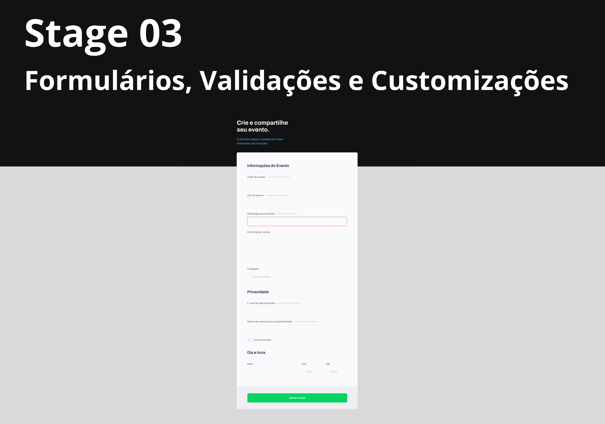

<h1 align="center"> Stage 03 - Formulários, Validações e Customizações </h1>

No curso Explorer vai aprender a programar do zero, irá te mostrar como é ser tomar um full stack. 
  
<a href="https://www.rocketseat.com.br/explorer"> Sabia mais</a>

  <a href="#-tecnologias">Tecnologias</a>&nbsp;&nbsp;&nbsp;|&nbsp;&nbsp;&nbsp;
  <a href="#-projeto">Projeto</a>&nbsp;&nbsp;&nbsp;

  
  

 

## 🚀 Tecnologias

Esse projeto foi desenvolvido com as seguintes tecnologias:

- HTML e CSS
- Figma

## 💻 Projeto

Conteúdo de estudo do Explorer

- [Assistir aulas](https://www.rocketseat.com.br/explorer)

---

Feito com ♥ by Rocketseat :wave: [Participe da nossa comunidade!](https://discord.gg/rocketseat)